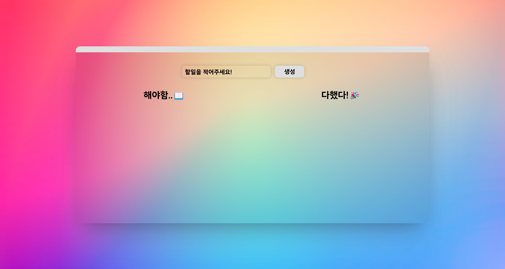

# 📌 할 일 관리(Todo)

deploy link: [Link](https://kdt-4-m3.vercel.app/)

사용한 기술 스택

- Basic: HTML, SCSS, JavaScript
- Deploy: Vercel
- Bundler: Parcel
- UsedLibrary: Axios, Sortable

## Goal

### ❗ 필수

- [x] 할 일 목록(List)이 출력돼야 합니다.
- [x] 할 일 항목(Item)을 새롭게 추가할 수 있어야 합니다.
- [x] 할 일 항목을 수정할 수 있어야 합니다.
- [x] 할 일 항목을 삭제할 수 있어야 합니다.
- [x] jQuery, React, Vue 등 JS 라이브러리와 프레임워크는 사용하지 않아야 합니다.
- [x] 실제 서비스로 배포하고 접근 가능한 링크를 추가해야 합니다.

### ❔ 선택

- [x] 할 일 항목의 순서를 바꿀 수 있도록 만들어보세요.([SortableJS](http://sortablejs.github.io/Sortable/))
- [x] 할 일을 완료하지 않은 항목과 완료한 항목을 분류해서 출력해보세요.
- [ ] 할 일을 완료한 항목을 한 번에 삭제할 수 있도록 만들어보세요.
- [ ] 할 일 항목의 최신 수정일을 표시해보세요.
- [x] 할 일 목록이 출력되기 전에 로딩 애니메이션이 보이도록 만들어보세요.
- [x] 기타 동작이 완료되기 전에 로딩 애니메이션이 보이도록 만들어보세요.
- [x] 차별화가 가능하도록 프로젝트를 최대한 예쁘게 만들어보세요.
- [ ] 할 일과 관련된 기타 기능도 고려해보세요.

## 구현한 기능

### 페이지의 전체적인 모습

그라데이션 배경화면을 활용하여 감각적인 느낌을 주었습니다.

### 할 일 추가

.gif)

할일을 먼저 입력하고 `enter` 키를 누르거나 옆에 있는 생성 버튼을 누르면 서버와 통신하여 할일을 추가합니다.

### 할 일 수정

.gif)

할일 옆에 있는 ✏️아이콘을 클릭하여 수정할 수 있는 알림창을 띄웁니다. 수정할 내용을 입력하고 `enter` 키를 누르거나 확인 버튼을 누르면 서버와 통신하여 수정합니다.

### 할 일 삭제

.gif)

할일 옆에 있는 ❌아이콘을 클릭하면 서버와 통신하여 삭제합니다. 먼저 삭제를 진행하기 전에 한번 더 확인하는 알림창을 띄워서 실수로 사용자가 지울 수 있는 실수를 방지하였습니다.

### 할 일의 순서 변경

.gif)

할일을 드래그 앤 드랍을 하여 순서를 변경할 수 있습니다. 서버와 통신하여 변경된 순서를 저장하게 되지만 별도의 데이터를 가져오는 과정이 없이 드래그 앤 드랍을 통하여 순서를 변경하여, 사용자가 느끼기에는 빠르게 순서가 변경되는 것처럼 느껴집니다.

### 할 일 완료

.gif)

할일을 드래그 하여 완료 영역에 드랍하면 서버와 통신하여 완료 한 것 으로 변경합니다. 별도의 서버의 데이터를 가져오는 과정이 없이 드래그 앤 드랍을 통하여 완료로 변경하여, 사용자가 느끼기에는 빠르게 완료로 변경되는 것처럼 느껴집니다.

그리고 완료한 일들의 순서들도 변경이 가능하며 중간에 끼어들어도 순서가 올바르게 변경되어 저장됩니다.

### 검증

.png)

할일을 입력할때, 별도의 `validation`을 걸어서 특정 문자열 조건을 만족하지 않다면, 사용자에게 알림으로 어떤 부분이 안되는지 알려줍니다.
특수문자는 !? 까지 허용하고, 띄어쓰기는 제한이 없습니다. 또한, 할일의 최대 길이는 15자로 제한 됩니다. 이러한 조건을 만족하지 않을 경우 함수를 
종료하게 됩니다.

### 로딩 애니메이션 구현

.gif)

### 설정 모달 구현

.png)

설정 모달을 구현하였습니다. 설정 모달을 통해 사용자가 원하는 설정을 키고 끌 수 있습니다. 설정을 할 수 있는 것은 총 두가지입니다.

- 다크모드를 켜고 끌 수 있습니다.
- 시계를 켜고 끌 수 있습니다.

설정 변경하는 것을 `getter, setter` 함수를 응용해  `localStorage`에 저장하며 새로고침을 하더라도 설정이 유지되도록 하였습니다.

### 다크모드

.gif)

위의 설정에서 다크모드를 설정할 수 있습니다. 다크모드에 돌입시 해당하는 테마가 적용됩니다. 

## 구현할 예정인 기능들..

- [x] 미디어 쿼리 적용완료하여 핸드폰에서도 작동이 가능합니다.

- [x] `day.js` 를 활용하여 시간을 표시하였습니다.

## 느낀점

이렇게 api를 이용하여 CRUD 패턴을 구현해보았습니다. 실제로 존재하는 api를 사용하여 구현 한 적은 처음이여서 여러움도 있었고, 게다가
다른 프레임워크를 사용하지 않고 오직 바닐라 자바스크립트와 몇개의 라이브러리를 사용하여 구현해보니, 신선한 경험이였습니다. 

